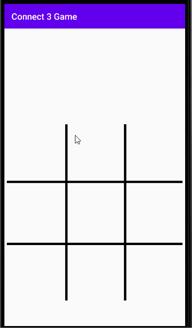

# Connect_3_Game

**Connect 3 Game** is a small for Android system.
Submitted by: **Lu He**
Time spent: **2** hours spent in total

## Technologies Used 
Android Studio, Java

## Win/Tie:
**Win:** if three same color counters line up, the player who plays this color is the winner.\
**Tie:** if the board is full and none wins the game.

## Video Walkthrough

GIF created with [LiceCap](http://www.cockos.com/licecap/).

Either of this status would end the game, and a **PLAY AGAIN** button and report text would appears.

